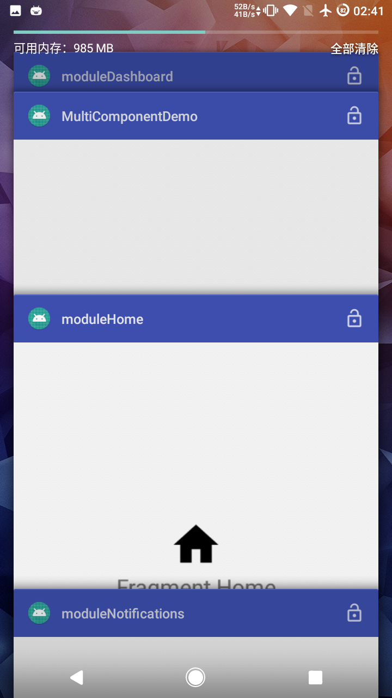

## Android 组件化 Demo

### 模块说明

app：宿主 App

commonBase：公共 Utils，资源文件，Base 类，第三方库

moduleHome：组件 Home

moduleDashboard：组件 Dashboard

moduleNotifications：组件 Notifications


### Gradle 配置

根目录 gradle.properties 加入，便于 application 与 library 切换

```
#组件单独调试开关，true 可以，false 不可以，每次修改后要 Rebuild Project
isBuildModule=true
```

组件 build.gradle 部分配置说明

```
// application 与 library 切换
if (isBuildModule.toBoolean()) {
    apply plugin: 'com.android.application'
} else {
    apply plugin: 'com.android.library'
}

android {
       defaultConfig {
        // 定义组件 applicationId 避免与宿主 App 冲突
        if (isBuildModule.toBoolean()) {
            applicationId "com.meiji.multicomponentdemo.${this.name}"
        }

        // ARouter 配置
        javaCompileOptions {
            annotationProcessorOptions {
                arguments = [moduleName: project.getName()]
            }
        }
    }

    resourcePrefix "${project.name}_" //给 Module 内的资源名增加前缀, 避免资源名冲突

    sourceSets {
        main {
            // 设置两套 AndroidManifest
            if (isBuildModule.toBoolean()) {
                manifest.srcFile 'src/main/AndroidManifestDebug.xml'
            } else {
                manifest.srcFile 'src/main/AndroidManifest.xml'
                // release模式下排除debug文件夹中的所有Java文件
                java {
                    exclude 'debug/**'
                }
            }
        }
    }
}

dependencies {
    api fileTree(include: ['*.jar'], dir: 'libs')
    // 所有组件都要依赖 commonBase 
    api project(':commonBase')
    annotationProcessor lib_arouter_compiler
}
```

宿主 App build.gradle 部分配置说明

```
// 只能用于 application
apply plugin: 'com.android.application'

dependencies {
    if (isBuildModule.toBoolean()) {
        implementation project(":commonBase")
    } else {
        implementation project(":moduleHome")
        implementation project(":moduleDashboard")
        implementation project(":moduleNotifications")
    }
}
```


### 组件间通信

因为组件间要单独调试，所以肯定不能直接引用某个组件内的类，例如

```
startActivity(AppMainActivity.this, ModuleHomeActivity.class)
```

由于 AppMainActivity 和 ModuleHomeActivity 不在同一个模块内，单独调试肯定无法通过编译，这时候就需要借助路由。何为路由，就是页面请求，都交给它处理。网上有很多路由库，我这里选的是阿里的 [ARouter](https://github.com/alibaba/ARouter) ，具体用法看官方文档。


### 重复依赖

每个模块都依赖 commonBase，但 Gradle 构建会自动将重复的 aar 包排除，如果同一个库使用了不同的版本号，Gradle 会自动选择高版本号。

模块的 AndroidManifest.xml 和宿主 App 的 AndroidManifest.xml，假如同时声明了 ModuleHomeActivity，构建 APK 也会自动将重复的 Activity 排除。


### Preview

|  |  |  |
| :---------------------------------------: | :---------------------------------------: | :---------------------------------------: |
|                 宿主 App                  |               模块单独运行                |             各个模块单独调试              |

